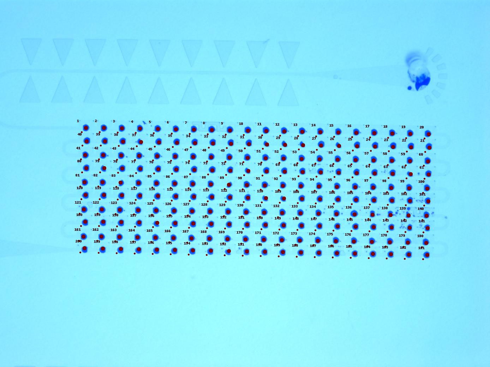
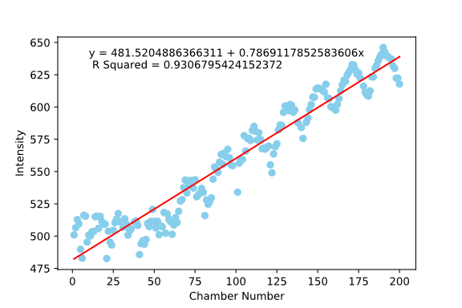
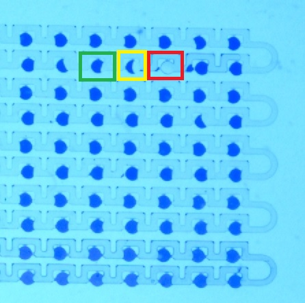

## Protocol for using SDA200: Use of PDMS device for the generation of a gradient (using dye)
### Section 1: Reducing the evaporation of the liquids inside the device:
1. Take the chip that you would like to use, and cover its devices with glass slides. (To block the inlets and outlets).
2. Tape the glass slides tightly to the PDMS.
3. Place the chip inside a tip box and fill the latter with enough deionized water so that the chip is immersed in water.
4. Incubate the chip at 37 ̊ C overnight. (Instead incubating the devices for a couple of hours before use may also work, more testing needs to be done for optimal time.)
5. Use the device immediately after taking it out of the water. But first, make sure no water is present in the inlets/outlets, by trying to cuck any water out using the p200 micropipette and gel loading tips. *Tip: start by sucking the liquid out of the inlets/outlets present near the edges first.*

*Note: The previous steps help reduce the evaporation that the droplets experience when incubated. Try to suck out any water present in the device (using micropipettes) before using the device.*

##### Method for injecting liquids in PDMS (applies to all steps below):
* Using both hands, gently insert the **gel loading tip** of the micropipette in the inlet/outlet. **[The tip should touch the bottom of the inlet]**. Start injecting the liquid **slowly**. If the solution escapes from the inlet/outlet, push the tip of the micropipette a little bit further in the inlet/outlet.

* While removing, **gently** place a kimwipe around the inlet/outlet and **slowly** pull out the micropipette in the same way you injected it in, make sure to remove your thumb from the pump as the tip is moving out of the inlet/outlet. Keep using kimwipes to remove any liquid present at the inlet or outlet.

_Note: The method above applies to all the steps below._

#### Taking images of the SDA200:
To take images if the SDA200, we used :
* Microscope: Zeiss Stereo Discovery.V8
* Objective: Plan S 1.0x FWD 81mm
* Camera: AxioCam MRc
* Software: ZEN 2.3 lite
* Light Pad  

The SDA200 was placed on a Light Pad placed under the objective of the microscope. The light pad was set to its second brightness. After adjusting the focus of the microscope in a way to be able to see the whole SDA200 device, we set the Exposure on the ZEN software to be 250.0 ms and the intensity to be 105%.

### Section 2: Filling the SDA200 device:

1.	Get 3 Eppendorf tubes. Assign each tube to one of the following liquids: Crystal Violet, 3M Novec 7500 oil and water. Place around 0.5 mL of each liquid in its corresponding tube.

2.	Use the **p20 micropipette**, set at **3 µL** to inject water in the **INLET** of the device. Keep injecting water (you can press beyond the first stop) till the water reaches the **first mark** following the inlet. (The pipette tip should be wiped with kimwipes before inserting in the inlet. The tip should be inserted until it reaches the bottom of the inlet. Failure to do so would negatively impact the gradient.) *Look at the image below to see the correct amount of water needed.*                          
__*Note: Make sure no air is present at the inlet area.*__
>Water Filling Image:

3.  Use the **p200 micropipette**, set at **50 µL**, to inject **Crystal Violet** in the **INLET** of the device. To do so, press the micropipette to the first stop, and keep pressing till the CV/water fills all the chambers and before it gets into the outlet area. (The pipette tip should be wiped with kimwipes before inserting in the inlet. The tip should be inserted until it reaches the bottom of the inlet.)
>Dye Filling Image:

4.	Use the **p200 micropipette**, set at **40 µL**, to inject **Novec oil** in the **OUTLET** of the device. To do so, press the micropipette to the first stop, **DO NOT RELEASE** your thumb until most of the crystal violet/water and the air present at the inlet area is pushed out. Use Kimwipes to absorb the liquid that comes out of the device.
>Oil Filling Image:

5. If you notice air pushing the oil out of the channels, inject more oil from the **OUTLET**, the same way you did in step

6. Cover the device using a glass slide, and use tape to make sure the inlets are blocked.

## Protocol for using Analyzing Gradient script:
#### Required Software:
* It is necessary to download the following programs to analyze your gradient:
  * Python 3.x.x is necessary to run the Analyzing Gradient script. Press on the following link if you don't have it already installed: [Download Python](https://www.python.org/downloads/ "Python").
  * You also need to install the following libraries:
    * [Pillow (image editing library)](https://pillow.readthedocs.io/en/stable/installation.html "Pillow")
    * [matplotlib](https://matplotlib.org/users/installing.html "matplotlib")
    * [pandas](https://pandas.pydata.org/ "pandas")
    * [numpy](https://scipy.org/install.html "numpy")
    * [scikit-learn](https://scikit-learn.org/stable/install.html "scikit")
  * Download a software that allows you to get the coordinates of pixels in an image. Our lab used ImageJ for this task. [Download ImageJ here.](https://serc.carleton.edu/earth_analysis/image_analysis/download_install_imageJ.html "ImageJ")

#### Finding the coordinates of a pixel on an Image:
*We recommend using ImageJ for finding the coordinates of pixels.*

1. Open the image of your SDA200 using the chosen software.

2. For ImageJ, hover your mouse pointer over a chosen pixel to get the x, y coordinates.

3. Use the following image to locate the chambers in (5).
>Image of the Samples: 
The small red circles in this image are the background sample areas, while the bigger red circles are the chamber sample areas. *Note: this example does not have a gradient.*

4. Hover over the centers of the listed chambers below in their respective order, and record the coordinates of their **centers** in the following format:  
> *x1,y1,x2,y2,x3,y3,x4,y4,x5,y5,x6,y6*  

Chambers:
* 1
* 21
* 20
* 161
* 40
* 191

*Note: It is recommended that you save the coordinate values with the name of the file in a separate file.*

### Analyzing the filled SDA200:
*This section will walk you through how to use the script*
1. Run the latest Analyzing gradient python file present in the repository.

2. When the following statement is printed, insert the Path of your image with the extention (i.e.: .jpg)
>Write file name with extension: (ex: .jpg)

Windows example answer:
 > C:\Users\USERNAME\Desktop\Microfluidics\Snap-178.jpg

 Mac OS example answer:
 >/Users/USERNAME/Desktop/Microfluidics/Snap-178.jpg

3. You will be given instructions on how to insert the coordinates of the centers of the chambers. Paste the coordinates, following "Centers:", that you recorded in step 5 of the previous section "Finding the coordinates of a pixel on an Image".
>Enter the following values separated by a comma (,), in the following order (TIP: save them on a separate file): 
1-centerx1: Type the x-axis value of the center of 1st chamber of the device 
2-centery1: Type the y-axis value of the center of the 1st chamber of the device 
3-centerx2: Type the x-axis value of the center of the 21st chamber of the device (1st chamber of the second row from the right) 
4-centery2: Type the y-axis value of the center of the 21st chamber of the device (1st chamber of the 2nd row from the right) 
5-srow1x: Type the x-axis value of the center of the 20th chamber of the device (Last chamber of the 1st row) 
6-srow1y: Type the y-axis value of the center of the 20th chamber of the device (Last chamber of the 1st row) 
7-scol1x: Type the x-axis value of the center of the 9th chamber of the 1st column (from the left): 
8-scol1y: Type the y-axis value of the center of the 9th chamber of the 1st column (from the left): 
9-srow2x: Type the x-axis value of the center of the 1st chamber of the 2nd row (from the right): 
10-srow2y: Type the y-axis value of the center of the 1st chamber of the 2nd row (from the right): 
11-scol2x: Type the x-axis value of the center of the 10th chamber of the last column (from the left): 
12-scol2y: Type the y-axis value of the center of the 10th chamber of the last column (from the left): 
>Template: Centers: centerx1, centery1, centerx2, centery2, srow1x, srow1y, scol1x, scol1y, srow2x, sorw2y, scol2x, scol2y 
>
>Centers:

 Example answer:
>225,400,1193,448,1188,410,225,706,229,434,1192,760

4. Background samples are an area of pixels located to the **bottom left of each chamber** (the smaller circles in "Image of the Samples"). The pixel with the maximal intensity will be chosen to normalize the intensity of the chamber with the background, and reduce the effect of the unequal lighting of the device. You will be prompted to insert a number, that will be used as **the distance (in pixels) between the center of the chamber and the center of the background sample**. For the images we generated, we used 12 pixels. Use ImageJ to estimate the distance that you want the Background Sample to be at, so that the area is **outside the chambers and the channels**. When prompted, insert the background sample distance (must be an integer).
>Background samples are used to normalize the intensity with the background
Insert the distance between the background sample and the center of the chamber. Type 0 or 12 for default (12 pixels).
Background sample distance from center of the chamber:

*Note: More information about the normalization process can be found in "The normalization of the intensities:" section.*

5. Insert the background sample radius of your choice, we used 2 pixels radius for our images (must be an integer).
>Background sample radius in pixels (2 pixels is recommended):

6. Insert the Chamber sample radius, we used 5 pixels radius for our images (must be an integer).
>Chamber sample radius in pixels (5 pixels is recommended):

7. You will be asked if you want to conver the brightness values to concentration values. To do so, you will need brightness values of a non-gradient control device filled with the colored solution and another one filled with just the dilutent (it is necessary to know the concentrations of both as well). If you would like to use this option, you shall type 1 when prompted with the message below, otherwise type any other number.
>The following step requires having brightness values from a non-gradient control device filled with the colored solution and one filled with the diluent
>Enter 1 if you wish to convert the light intensities to concentration values
>otherwise enter any other number:

8. The following steps only apply if you typed one on step 7:
 * Insert the average brightness of the chambers of the non-gradient colored solution filled device
>Enter the average brightness of the chambers in the non-gradient control colored solution:
 * Insert the average brightness of the chambers of the non-gradient dilutant filled device
>Enter the brightness of the solution in the last (most diluted) chamber: (if water is the diluent, it will be the brightness of the water)
 *Type in the concentration of the undiluted stock solution
>Enter the concentration of the undiluted solution in the control device:
 *Type in the concentration of the diluting solution
>Enter the concentration of the diluting solution in the control device:

8. The first and last 30 values of intensities will be printed automatically. Nothing should be done.

9. You will need to **create a file**, where you would like to have your results saved in. You will get **data.csv** file containing the intensity values, a **plot.svg** containing an image of the plot of the intensities VS indices and a **Samples.jpg** showing the indices of the chambers, and the Background and chamber sample areas.  
Paste the **path of the file** you created when prompted.

>Create a new file with the name of the image, and insert its Path here. Add '/ ' to the end, if you are working on a mac, and  ' \ ' if you are working on windows : (All the resulting files will be saved in it)

Windows example:
> C:\Users\USERNAME\Desktop\Microfluidics\Snap-178\

Mac OS example:
> /Users/USERNAME/Desktop/Microfluidics/Snap-178/

10. You will see the output of your plot.
>Example image of the output plot: 

##### The normalization of the intensities:
###### Main Method:

1. The script takes the maximal intensities of all the background samples and calculates the average maximal intensity.

2. For each chamber, the script calculates the **average inensity of each** droplet, while removing all pixels that are suspected to not be part of the droplet (you can find how the filtering of these pixels is done in the "Removing pixels that are not part of the droplet" section).

3. For each chamber, the program calculates the **intensity variation** caused by lighting, by dividing the maximal intensity of the background sample by the average maximal background intensities. **"coefficient of variation"** = 2 - **intensity variation**

4. Finally, the code multiplies the **average intensity of each droplet** with its respective **"coefficient of variation"**.

###### Simpler method (doesn't use background intensity):

We used the [*LinearRegression* function](https://scikit-learn.org/stable/modules/generated/sklearn.linear_model.LinearRegression.html "LinearRegression") of sklearn.linear_model to find a linear function. The **linear function** and the **unnormalized intensity** values are displayed on the plot. The **equation of the linear function and the R squared value** of the linear regression are both in the **.csv file** and on the **plot**.

##### Removing pixels that are not part of the droplet:
The following steps are followed by the script to eliminate pixels that are not part of the droplet:
1. After finding the pixels of the chamber sample, the standard deviation of the intensities of the pixels is calculated.

2. If the standard deviation of a chamber sample is above 4, then the script considers that the sample is not completely filled, it potentially contains one or more pixels that are not part of the droplet.

3.  The intensities of the pixels of not completely filled samples are then compared with the background sample maximal intensity. If the difference between the two intensities is less than 60, then the pixel's intensity is discarded.

4. If more than half the intensities are disregarded, then the whole chamber sample is discarded.
>Example:
  * In the image below, the droplet in the green square may need to have a very small amount of its pixels disregarded.
  * The droplet in the yellow square will have most of its pixels disregarded, and it the number of pixels available at the is less than half the original amount of pixels, the droplet will be discarded.
  * Finally, the chamber in the red square was not filled at all. Thus it will be discarded if its pixels have a standard deviation greater than 4.
>
